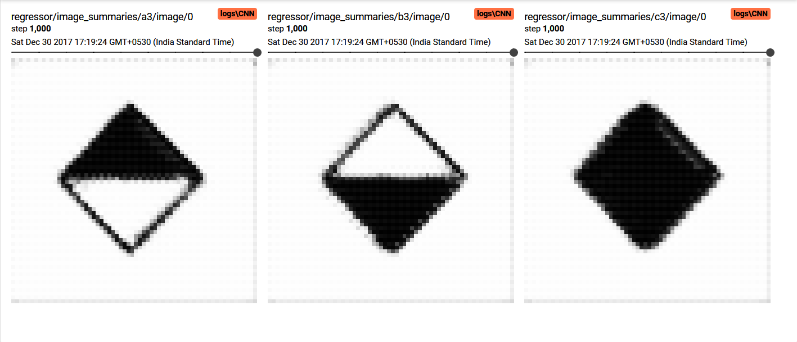
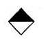
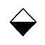
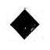
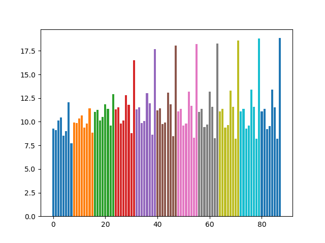

# Zero shot Raven's Progressive Matrix solver (Work in progress)

Solving [Raven's Progressive Matrix](https://en.wikipedia.org/wiki/Raven%27s_Progressive_Matrices) using an autoencoder configuration without any prior training.

# Results

## Obtained

## Expected

## PSNR

The diagram shows the PSNR between the available options and the predicted output. Each color represents an epoch and each of the eight bars of same color represent the eight available options.

 The last option is the correct answer and has the highest PSNR as expected.